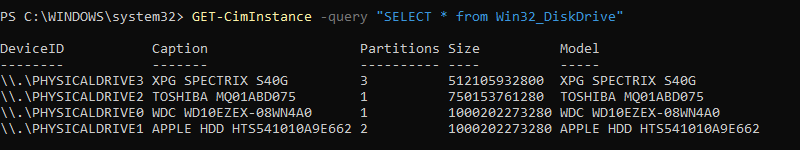
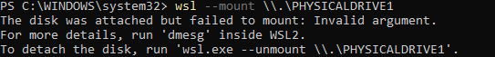
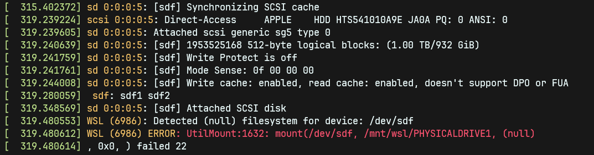
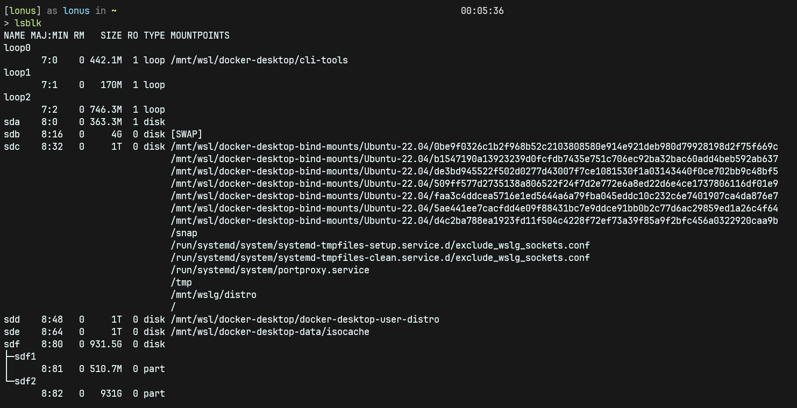

+++
author = "Lonus"
title = "Mounting external EXT4 drive to WSL2"
date = "2023-09-21T03:19:12-04:00"
description = "How to mount a ext4 partition of an Ubuntu instance into WSL2."
tags = ["linux", "ubuntu", "wsl2", "windows"]
categories = ["linux", "ubuntu", "wsl2", "windows"]
aliases = ["wsl2-mounting-drive"]
image = "assets/images/EXT4WSL.png"
+++
<!--adsense-->

>**TLDR:** If you know what you're doing and know which partition is your Linux install and don't want to read non-sense get the DeviceID in powershell with:

```
GET-CimInstance -query "SELECT * from Win32_DiskDrive"
```

After that run, just change the name of PHYSICALDRIVE1 to your drive name:

```
wsl --mount \\\\.\PHYSICALDRIVE1 --partition 2 --type ext4
```
Once mounted go to the path where is mounted in WSL:
```
/mnt/wsl/PHYSICALDRIVE1p2 # the PHYSICALDRIVE name should correspond to your drive name the p2 is just partition 2
```
## Reason why....
Dual boot systems have always fascinated me, particularly when I'm engrossed in coding or experimenting with Docker. My typical setup involves Windows and Ubuntu residing on separate drives. Occasionally, I find myself initially working on Windows and needing to access a specific file or container. In such moments, I recall that the file I want to use a references or an older project where the was a references for something is on my Ubuntu installation and having to reboot and boot into Ubuntu it removes the working flow and tedious since it requires me to either commit the project to a repo or copying it to a external hard drive.

>Yes using the external hard drive to always have access to the files would be the best but this is not the case because on Windows using WSL2 the performance of reading/writing files from an external drive or even the main drive where Windows is installed is not the best.

So one way to avoid the rebooting process and such is mounting drive of my Ubuntu installation into WSL2.

 Be careful, this method is easier when both OS are installed on different drives, I DO NOT know if this works on dual boots that are on a single drive.

<!--adsense-->

## Getting the deviceID of the drive

On Windows to get the deviceID of the drive to mount, On a powershell terminal running as admin, I run the following command:

```powershell
GET-CimInstance -query "SELECT * from Win32_DiskDrive"
```
### Know the query!
The query provided is written in PowerShell and is used to retrieve information about disk drives on a Windows system using CIM (Common Information Model) cmdlets.
#### Query Breakdown

**GET-CimInstance** :
- This is a PowerShell cmdlet used to retrieve information from CIM (Common Information Model) classes. CIM is a standard for representing management information about computer systems and devices. It provides a standardized way to access and manage various aspects of a computer system, including hardware components like disk drives.

**-query**
- This parameter specifies that you want to use a query to filter the CIM instances you retrieve.

**SELECT * from Win32_DiskDrive**
	This is the actual query string provided within double quotes. Let's break down this query string further:

**SELECT**
 - The SELECT * statement is similar to SQL and is used to specify which properties or columns you want to retrieve from the CIM class. In this case, * is used as a wildcard, indicating that you want to retrieve all properties (i.e., all available information) for each instance of the Win32_DiskDrive class.

**from Win32_DiskDrive**:
- This part of the query specifies the CIM class you want to query. The Win32_DiskDrive class represents physical disk drives on the Windows system. This class contains a wide range of properties that describe these disk drives, such as their manufacturer, model, size, and more.

So, when you run the GET-CimInstance command with the provided query, PowerShell will reach out to the Windows Management Instrumentation (WMI) subsystem to query the Win32_DiskDrive class. It will retrieve all available information for each disk drive connected to the system and display this information in the PowerShell console.

The output will include details like the disk drive's name, manufacturer, model, interface type (e.g., SATA or NVMe), capacity, and other relevant information about the physical disk drives on the computer. This command is commonly used by system administrators and technicians to gather hardware information for monitoring, troubleshooting, or inventory purposes.




As you can see there is a list of hard drives connected to my PC, in this case my Ubuntu installation is in the drive with the name **"APPLE HDD HTS541010A9E662"** and the **DeviceID** corresponding to that drive is  **"\\\\.\\PHYSICALDRIVE1"**.

 It is important to copy the DeviceID name with the all the \ 

<!--adsense-->

## Mounting the drive to wsl2
Once I get the `DeviceID` of the drive I want to mount, lets pass the following command still in powershell.

```powershell
wsl --mount \\.\PHYSICALDRIVE1
```
Since this command is mounting the entire drive its most likely to throw the following error, due to wanting to mount the first partition of the drive which is probably the EFI, I'm able to see the error in WSL with `dmesg`.
```
The disk was attached but failed to mount: Invalid argument.
For more details, run 'dmesg' inside WSL2.
```


Now open a new terminal into the WSL instance, first lets verify the error how it said in the last command output by typing `dmesg` in the WSL instance.



As you can see the full drive was mounted but throws `failed 22` when trying to mount the first partition, which in this case is the EFI partition from the Ubuntu and I can also see where my drive is mounted here its in `/dev/sdf`, I can check if that's true with `lbslk`.



With `lsblk` I can see the drive and its partitions `sdf` for the drive and `sdf1` for the EFI partition and `sdf2` for partition where Ubuntu is installed.

<!--adsense-->

## Mounting the ext4 partition

From the `lbslk` command I see the two partitions of my drive, unless you did a different formatting to the partition where you installed your Linux the most common format for Ubuntu is `ext4`, if you changed the format you might need to change the following command.

Since know my partition is under `sdf2` which is the second partition and its also `ext4` formatted, I need to type it like this:

```powershell
wsl --mount \\.\PHYSICALDRIVE1 --partition 2 --type ext4
```


<!--adsense-->

## Accessing the partition
Once the correct partition is mounted, It'll be mounted in the following path
```bash
/mnt/wsl/PHYSICALDRIVE1p2 # the PHYSICALDRIVE name should correspond to your drive name the p2 is just partition 2
```
and that's it now I can access the files of my Ubuntu instance without needing to restart the entire computer.

<!--adsense-->