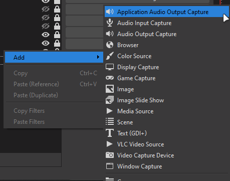
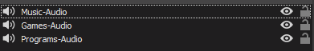
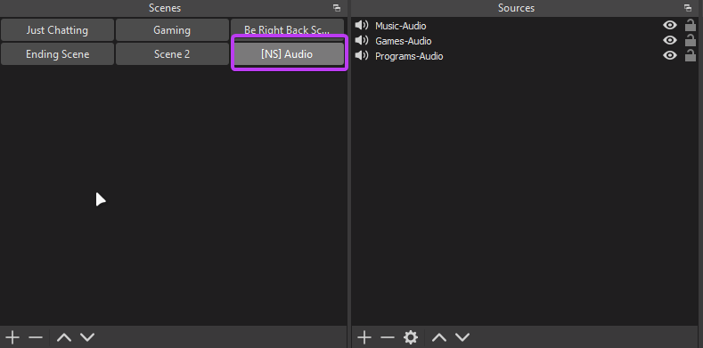
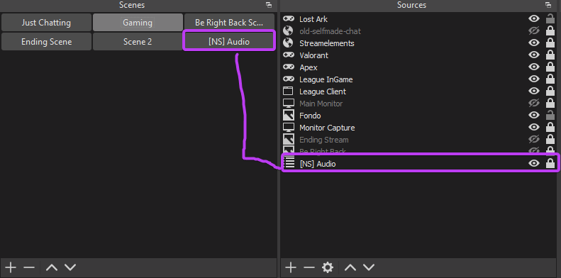
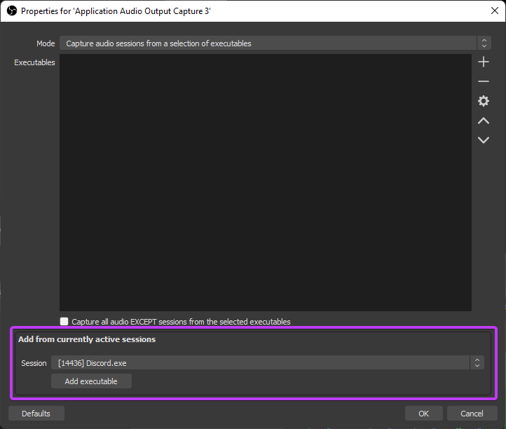
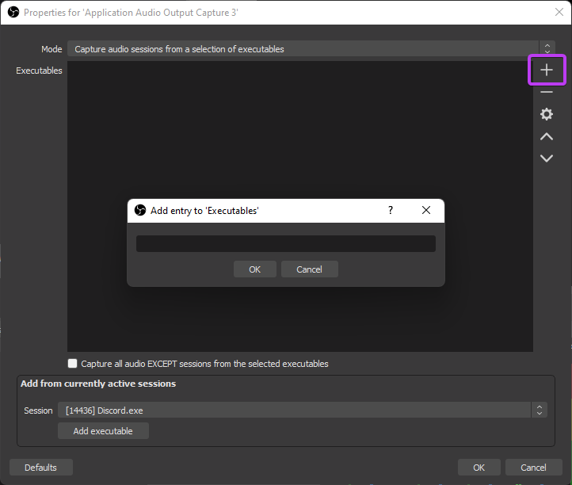
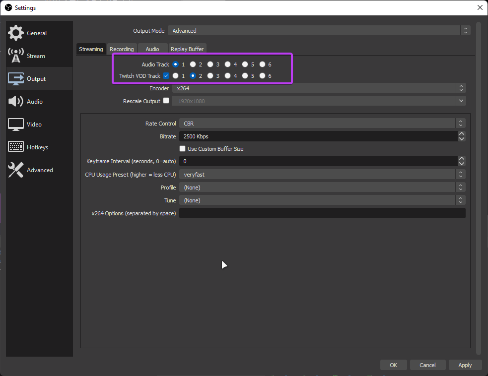
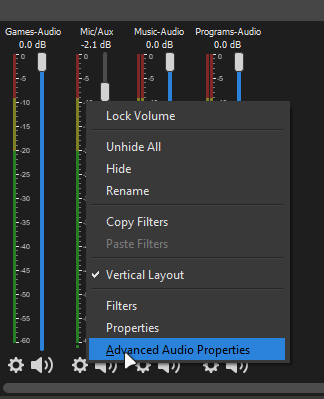
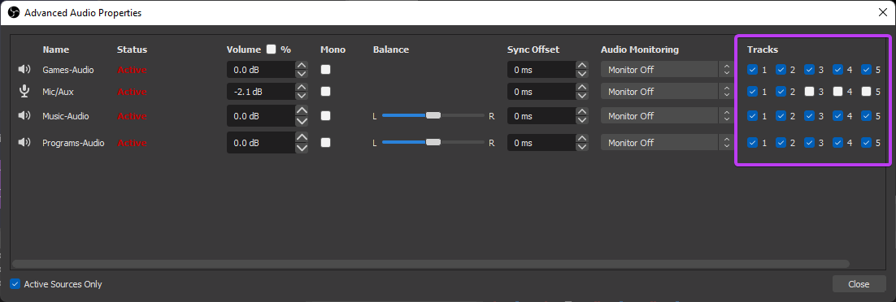
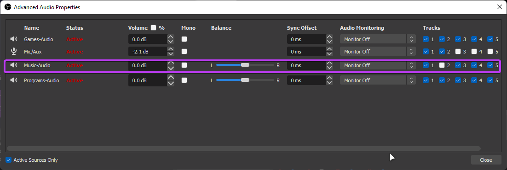

+++
author = "Lonus"
title = "OBS Split Audio Guide"
date = "2022-06-11"
description = "Sample article to teach you how to split OBS audio sources."
tags = [
    "markdown",
    "css",
    "html",
    "themes",
]
categories = [
    "Guide",
    "Streaming",
    "OBS",
]
series = ["OBS Guide"]
aliases = ["migrate-from-gist"]
image = "obs-studio.jpeg"
+++

## **What you need:**

1 - OBS studio

2 - win-capture-audio, this is the program you need to split the audio. You can download it here :

> https://github.com/bozbez/win-capture-audio/releases/download/v2.2.2-beta/win-capture-audio-2.2.2-beta-setup.exe

## Installation and Usage

Once you downloaded the program run the installer (make sure OBS is not open) it's a fast installation once it finish you can launch OBS now if you add a new source there should be a new option called `Application Audio Output Capture`

## Adding the audio sources:

> Since you can add multiple programs to the same source I recommend creating a source specially for each type of group for example did it like this:
> 
> 
> 
> The `Music - Audio` group it's a must since here is where you're going to add the programs that bring music to the stream like **Spotify** or **Google chrome(nightbot/youtube)** and its gonna allow to separate it from the VOD audio track.
> 
> Also to avoid having to add each audio source to different scenes a good trick is creating a new scene and there add all the audio sources groups you're gonna use and once you are done with setting up everything all you have to do is add that scene as a source in the multiple scenes that you use so every time you add a new group of audio sources it automatically adds them to the mixer of each scene.

 

### **Add your programs:**

Here you have to ways to add programs/games.

1. **Add from currently active sessions menu**: In this menu it should give you a list with the most common program. (ex: Discord, Spotify) and some others that the plugin might detect. Once you selected the program just click in the `Add Executable`. You can add multiple programs as a group to the same audio source.
   
   

2. **Using the `+` next to the executables area:** If the program you want to add to a certain group of sources doesn't show up in the `Session` menu you might wanna added the program executable manually. For example if you want to add **Google Chrome** and it doesn't show up in the list you add it by clicking in the `+` button and type `chrome.exe` and press **ok** and it should be added to the **Executables** area.
   
   

> **IMPORTANT !! : SINCE OBS IS CREATING AUDIO TOO BECAUSE YOU HAVE CLIPS/ALERTS AND SUCH THINGS AS BROWSER SOURCE INSIDE OBS YOU SHOULD ADD OBS ITSELF AS AN AUDIO SOURCE SO VIEWERS GET TO HEAR THEM ON STREAM**

If the program you want to add doesn't show up in the **Session** menu and you have to manually add it but you dont know whats the name of the executable you can get it in the `task manager` in the `details` tab. (`Open it by pressing Windows key + type taksmngr` and it should be the first option) there you can see all the programs executable names. (ex: `chrome.exe`). Most of the time the executable is `programname.exe` but sometimes its different.(ex: for Apex Legends is `r5apex.exe`).

**NOTE - League of Legends:**

For league you have to add two sources `LeagueClientUxRender.exe` and `League of Legends.exe` the first one is for the **league client** audio and the second one is for when youre inside the game audio. Both should automatically appear in the session menu when you open the client and when you get in a game. (you can set up the second by going into a custom game/practice tool).

## **Telling Twitch which applications audio you want to get saved in the VOD audio:**

Inside OBS settings you want to change the `Output mode` from **simple** to **advanced** once you do this you should see the `Twitch VOD Track` option under the `Audio Track` select the checkbox and by default it has the track `2` you can leave it as it is or change it, up to you. Just keep in mind that it should not be the same as the `Audio Track`.

## Disabling audio track :

Once you have the option enabled and all your audio sources added the next step disabling the track `2` to the sources that you don't want to be saved in the VOD.

> Remember the `Music - Audio` source we created before here it's why we need it to be like that.

For this you click in the cog wheel of any audio source and go to `Advanced Audio Properties`.

Then a new window should pop-up and it should show you all the audio sources and their `audio tracks`

See how we have multiple numbers and check boxes in `Tracks`. Remember that by default `Twitch VOD Track` that is selected in Settings is the track `2`, since we don't want Twitch to save our`Music - Audio` in the VOD what we do is we uncheck the track `2` from `Music - Audio` or any other audio source you want to exclude from the VOD.

> Note: Only uncheck the track that you selected as your twitch vod track because if you uncheck any other track not only it wont get recorded in the VOD, viewers won't be able to listen to that source on stream.

Now from now on your vods should not record any music source.